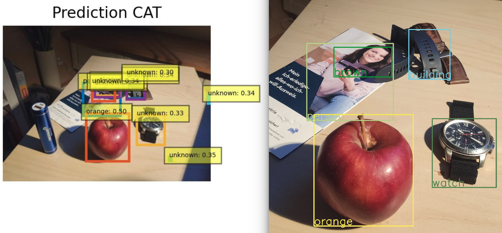
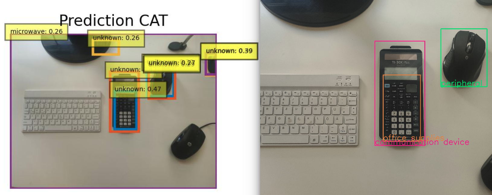

# WILD- CAT: Web-Integrated LoCalization and Detection of Unknown Objects with CAT
This repo is an implementation of the paper [WILD CAT](/WILD_CAT.pdf)

While traditional detectors are limited to recognizing a fixed set of classes, **WILD-CAT**(Web-Integrated LoCalization and Detection of Unknown Objects with CAT), powered by the innovative transformer based ([CAT](https://github.com/xiaomabufei/CAT)) model, goes a step further. This repository leverages the unique capabilities of CAT by seamlessly integrating web-based image reverse search engines.  This repository automates the acquisition of fresh tagged data from the web, enriching the training dataset and continually refining the detector's performance. When faced with unknown objects, WILD-CAT initiates a web search for descriptions, incrementally learning and enhancing its detection capabilities.


### Results






# Installation

### Requirements

We have trained and tested our models on `Ubuntu 16.0`, `CUDA 10.2`, `GCC 5.4`, `Python 3.7`. The evaluation with pretrained weights was done using the NVIDIA Geforce GTX 960.

```bash
conda create -n cat python=3.7 pip
conda activate cat
conda install pytorch==1.8.0 torchvision==0.9.0 torchaudio==0.8.0 cudatoolkit=10.2 -c pytorch
pip install -r requirements.txt
```

### Backbone features

Download the self-supervised backbone from [here](https://dl.fbaipublicfiles.com/dino/dino_resnet50_pretrain/dino_resnet50_pretrain.pth) and add in `models` folder.

### Compiling CUDA operators
```bash
cd ./models/ops
sh ./make.sh
# unit test (should see all checking is True)
python test.py
```


### Weights

[T1 weight](https://drive.google.com/file/d/1Q9e2bhZ3-VvuOrEGN71SHUBwwhc6qS8q/view?usp=sharing)      |      [T2_ft weight](https://drive.google.com/file/d/1XLOuVnAW5z7Eo_13iy-Ri_SzkcO_2gok/view?usp=sharing)      |      [T3_ft weight](https://drive.google.com/file/d/1XDMU2uulDUFGFyV0UIrU8D9HVBGeDTbh/view?usp=sharing)      |      [T4_ft weight](https://drive.google.com/file/d/1bq5yqwNKKgXZiRrfonda7mNIWislmmW7/view?usp=sharing)

### Dataset Preparation

#### Custom made Pictures
This code project supports custom made pictures. Therefore the custom made pictures should be placed in `data/OWDETR/VOC2007/JPEGImages`. But be aware in order to process this pictures without any target data a few different steps are necessary to evaluate. Please refer to the evaluation section.

#### Large Datasets

The splits are present inside `data/OWDETR/VOC2007/ImageSets/` folder.
1. Make empty `JPEGImages` and `Annotations` directory.
```
mkdir data/VOC2007/CAT/JPEGImages/
mkdir data/VOC2007/CAT/Annotations/
```
2. Download the COCO Images and Annotations from [coco dataset](https://cocodataset.org/#download).
3. Unzip train2017 and val2017 folder. The current directory structure should look like:
```
CAT/
└── data/
    └── coco/
        ├── annotations/
        ├── train2017/
        └── val2017/
```
4. Move all images from `train2017/` and `val2017/` to `JPEGImages` folder.
```
cd CAT/data
mv data/coco/train2017/*.jpg data/VOC2007/CAT/JPEGImages/.
mv data/coco/val2017/*.jpg data/VOC2007/CAT/JPEGImages/.
```
5. **Annotations_selective** :The Annotations can be made by the file **"make_pseudo_labels.py"**

The files should be organized in the following structure:
```
CAT/
└── data/
    └── OWODETR/
        └── VOC2007/
        	├── JPEGImages
        	├── ImageSets
        	└── Annotations_selective
```

Currently, Dataloader and Evaluator followed for CAT is in VOC format.
    
# Training

#### Training on single node

To train CAT on a single node with 8 GPUS, run
```bash
./run.sh
```

#### Training on slurm cluster

To train CAT on a slurm cluster having 2 nodes with 8 GPUS each, run
```bash
sbatch run_slurm.sh
```
### Training on single GPU
To train CAT on a single GPU you can try run
```bash
./run_custom.sh
```


# Evaluation

## Large datasets
For reproducing any of the above mentioned results please run the `run_eval.sh` file and add pretrained weights accordingly.

## Custom made pictures with web support
For evaluating the detector on custom made pictures the simple place the pictures as stated in dataset preparation in the `JPEGImages` folder. Then simple run 
```bash
./run_eval_custom.sh
```
This should create pseudo labels in the Annotations folder, process the pictures and search for the unknowns in the web using google, bing or the both of them. The then created output can be seen in the `/output` folder. Every picture beginning with `img_*` is the direct output of the CAT detector and every output beginning with `web_*` is a web supported/labelled output.

**Note:**
For more training and evaluation details please check the [Deformable DETR](https://github.com/fundamentalvision/Deformable-DETR) reposistory.

# Web-based search
In order to use the web searching capabilities you must create an microsoft azure account and create an [Computer Vision Ressource](https://portal.azure.com/#create/Microsoft.CognitiveServicesComputerVision). 
Create a python file called `key.py` and store the subcription key as `subscription_key_azure` and the endpoint as `endpoint_azure`. 
For accessing the google cloud vision API you must creat yourselfe an google cloud account and activate the [cloud vision API](https://cloud.google.com/vision/?hl=de&_ga=2.92802013.-1946153688.1682577171&_gac=1.261494271.1683295912.Cj0KCQjw0tKiBhC6ARIsAAOXutnq2wrlX0Zv9-0Nwn1HTHQ1Ffabq6FJHz_u1amrFTIu5J-MSNTIDEoaAumHEALw_wcB). 


# License


# Citation

If you use CAT, please consider citing:
~~~
@article{dario2023wildcat,
  title={Web-Enabled Object Detection with CAT: Unveiling Unknown Instances},
  author={Dario Spoljaric, Markus Vincze},
  journal={},
  year={2023}
}
~~~

# Contact

Should you have any question, please contact :e-mail: e11806417@student.tuwien.ac.at

**Acknowledgments:**

WILD-CAT builds on the work of [CAT](https://github.com/xiaomabufei/CAT) and much other previous works as [OWDETR](https://github.com/akshitac8/ow-detr),[Deformable DETR](https://github.com/fundamentalvision/Deformable-DETR), [Detreg](https://github.com/amirbar/DETReg), and [OWOD](https://github.com/JosephKJ/OWOD). If you found WILD-CAT useful please consider citing these works as well.


